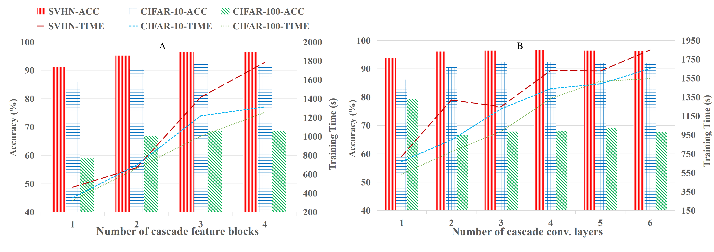

# Gradient Descent Broad Learning System (GDBLS)

Hello, this is an implementation for GDBLS, an efficient model structure for deeplearning using broad-wise methods. 

**
Model Structure
**

**
Outcome
**

## Implements
1. model/gdbls_conv3block3.py for a specific resolution of 32*32.
2. model/gdbls_conv3block3_dogcatversion for any resolutions.
3. resnet_fpn.py 
   The model was used for comparison with the resnet-based feature pyramid structure to justify the feature blocks we designed.
4. gdbls_conv3block3_noEB.py
   The model was used to demonstrate the feasibility and necessity of our feature enhancement strategy.
 
## Provided experiments
1. MNIST (1, 32, 32)
2. SVHN (3, 32, 32)
3. CIAFR10 (3, 32, 32)
4. CIFAR100 (3, 32, 32) (no confusion matrix provided.)
5. CATORDOG (3, 200, 200)

## Steps to perform the experiment
To carry out experiment on specific dataset, just follow the folling phases:
1. Download dataset from this url:
   https://drive.google.com/file/d/1Pks8OcOi7IZG_MvBRseX_RMfSABeTd3m/view?usp=sharing
2. Extract files in ./datasets folder
3. Deploy the environment using pip for two sub-projects: GD_BLS and statserver. 
4. Open ./statserver and run run.py using flask.
5. In main.py, select the dataset and model you need to validate, specifying the name of this experiment and the number of repetitions, let it run.
6. After the experiment completed, you will see many records in ./statserver/saves/data.csv. In analyse.py, run an analyse with information provided from main.py and you can analyse the detailed experiment information.

## Something to pay attention to
1. For each dataset, the configs are written to ./configs/[dataset_name].yaml 
2. ./logs/[dataset_name]/ saves the confusion matrix of the newest experiment.

## Original Device Information
We implemented GDBLS in Python with Keras and Pytorch and performed experiments using an Intel Xeon E5-2678 CPU with 128G memory, and an GPU of NVIDIA GeForce RTX 3080. 

